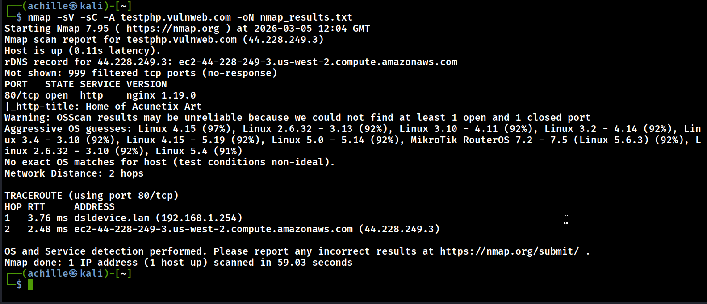
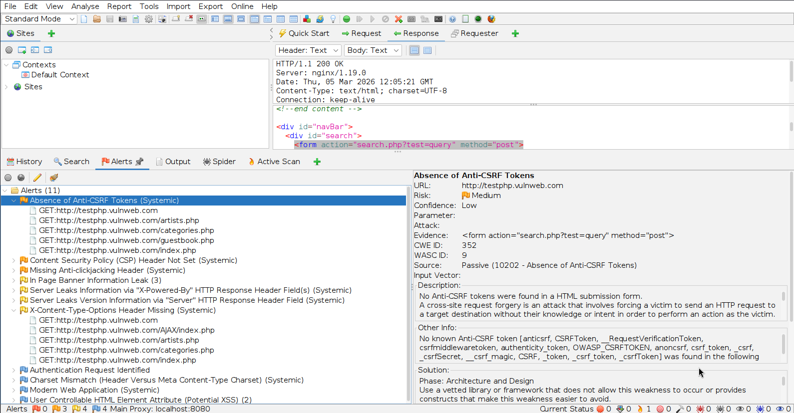

# Vulnerability Assessment Report — testphp.vulnweb.com

**Intern:** Hodome Kokou Achille  
**Program:** Future Interns — Cyber Security Fellowship  
**CIN:** FIT/MAR26/CS6617  
**Date:** March 3, 2026  
**Target:** http://testphp.vulnweb.com  

---

## 1. Introduction

For Task 1 of the Future Interns Cyber Security program, I ran a vulnerability assessment on `testphp.vulnweb.com`. This is a test web application deliberately made vulnerable by Acunetix for training and security testing purposes — scanning it is fully authorized.

The idea was to go through the site the same way a security analyst would: start with network reconnaissance, move to web application scanning, and finish with a manual look at the HTTP headers. Nothing fancy, just a structured approach to see what's exposed.

**Tools used:**
- Nmap 7.95 — network scan
- OWASP ZAP — web application scan
- Browser DevTools — manual header inspection

---

## 2. Network Reconnaissance — Nmap

Command:
```
nmap -sV -sC -A -oN nmap_results.txt testphp.vulnweb.com
```

Key findings from the scan:

- IP address: `44.228.249.3`, hosted on AWS EC2 (us-west-2)
- Only **port 80 (HTTP)** is open — port 443 (HTTPS) is not
- Web server: **nginx 1.19.0**, which dates back to 2020
- OS: likely Linux kernel 4.x or 5.x (Nmap couldn't confirm exactly)

The absence of HTTPS is probably the most important finding here. All traffic between the user and the server goes through plain HTTP, which means anyone on the same network can read it — passwords, session tokens, everything.

The nginx version is also worth noting. 1.19.0 is quite old and may have known vulnerabilities that have since been patched in newer releases.



---

## 2. Web Application Scan — OWASP ZAP

I ran an automated scan with OWASP ZAP and got back 14 alerts. Below I've grouped them by severity and explained what each one actually means in practice.



---

### High

**Potential XSS — User Controllable HTML Attribute**  
ZAP flagged places where user input gets reflected into HTML attributes without being sanitized first. In practice, this means an attacker could craft a URL or input that injects JavaScript into the page, and that script would run in the browser of anyone who visits. This is one of the most common and dangerous web vulnerabilities out there.  
*Fix: Escape all user input before rendering it in HTML — `htmlspecialchars()` in PHP, or equivalent in other languages.*

**Absence of Anti-CSRF Tokens**  
None of the forms on the site use CSRF tokens. Without them, an attacker can build a malicious page that silently submits a form on behalf of a logged-in user. The user doesn't click anything suspicious — they just visit a page and a request is made in their name.  
*Fix: Generate a unique token per session and validate it on every form submission.*

---

### Medium

**Content Security Policy (CSP) Header Not Set**  
No CSP header means the browser has no instructions on which scripts or resources it should trust. This makes XSS exploits much easier — injected scripts can run without any browser-level restriction.  
*Fix: Set a CSP header like `Content-Security-Policy: default-src 'self';` in the server config.*

**Missing X-Frame-Options Header**  
Without this header, the site can be loaded inside an iframe on a third-party page. This enables clickjacking — an attack where the victim thinks they're clicking on something harmless but are actually interacting with the target site underneath.  
*Fix: Add `X-Frame-Options: DENY` to HTTP responses.*

**Strict-Transport-Security (HSTS) Not Set**  
HSTS tells the browser to always use HTTPS for this domain. Without it, even if HTTPS were configured, an attacker could strip the connection back down to HTTP without the user noticing.  
*Fix: Add `Strict-Transport-Security: max-age=31536000; includeSubDomains` once HTTPS is in place.*

---

### Low

**X-Content-Type-Options Header Missing**  
When this header is absent, some browsers try to guess the MIME type of a response instead of using the declared one. This can be abused to make the browser execute something it shouldn't.  
*Fix: Add `X-Content-Type-Options: nosniff`.*

**Charset Mismatch Between Header and Meta Tag**  
The charset declared in the HTTP response header doesn't match the one in the HTML `<meta>` tag. It's a minor inconsistency, but in some older browsers it can open the door to encoding-based injection tricks.  
*Fix: Align both to UTF-8.*

---

### Informational

**Server Header Discloses nginx Version**  
The `Server: nginx/1.19.0` header is sent with every response. On its own it's not exploitable, but it gives attackers a clear target for known CVEs against that version.  
*Fix: `server_tokens off;` in nginx.conf.*

**X-Powered-By Header Discloses PHP**  
Same idea — this header reveals the backend language. Combined with the Server header, an attacker now has the full tech stack.  
*Fix: `expose_php = Off` in php.ini.*

**In-Page Banner Information Leak**  
Some version or environment info is visible in the page itself (in banners or HTML comments). Doesn't cause direct harm, but adds to the reconnaissance picture.

**Unix Timestamp Disclosure**  
Timestamps in Unix format appear in some responses. Very low risk, but worth cleaning up anyway.

**Authentication Form Detected**  
ZAP picked up a login form. Not a vulnerability by itself, but combined with the lack of HTTPS and CSRF protection, credentials submitted through this form are at real risk.

---

## 4. Summary

| # | Vulnerability | Severity |
|---|---|---|
| 1 | No HTTPS | High |
| 2 | Potential XSS | High |
| 3 | No CSRF Tokens | High |
| 4 | CSP Header Missing | Medium |
| 5 | X-Frame-Options Missing | Medium |
| 6 | HSTS Not Set | Medium |
| 7 | Outdated nginx 1.19.0 | Medium |
| 8 | X-Content-Type-Options Missing | Low |
| 9 | Charset Mismatch | Low |
| 10 | Server Version Leak | Info |
| 11 | X-Powered-By Disclosure | Info |
| 12 | In-Page Info Leak | Info |
| 13 | Timestamp Disclosure | Info |
| 14 | Auth Form Identified | Info |

3 High — 4 Medium — 2 Low — 5 Informational

---

## 5. Conclusion

Overall, the site has a fairly typical vulnerability profile for an unpatched web application. The three high-severity issues — no HTTPS, missing CSRF tokens, and a potential XSS vector — are the ones that would cause real damage on a production site. The medium findings are mostly missing security headers, which take about ten minutes to configure properly.

Nothing here requires a complete rewrite. Most of it is configuration. The fact that so many issues come down to missing headers shows that a basic security hardening pass would go a long way.

Overall risk: **High**

---

*Scan performed on: March 3, 2026*  
*Target: testphp.vulnweb.com (authorized Acunetix test environment)*  
*Tools: Nmap 7.95, OWASP ZAP, Browser DevTools*
